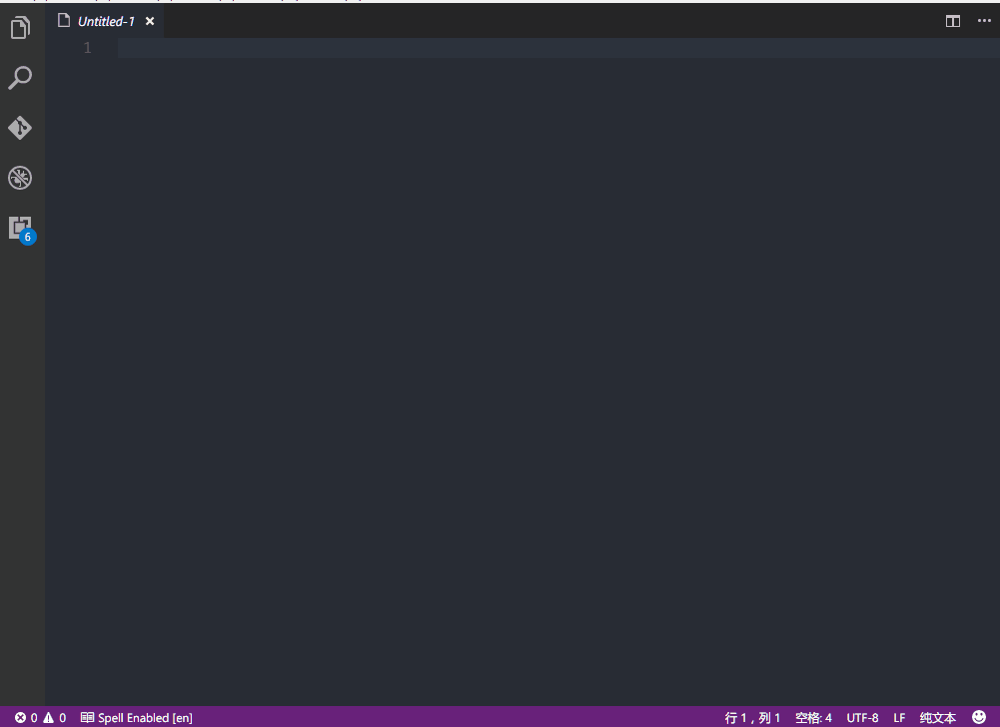
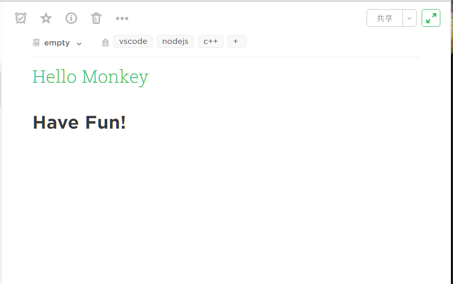

# EverMonkey

[](https://travis-ci.org/michalyao/evermonkey)

Evernoting in vscode. [中文版说明](README_zh-CN.md)

## Features

You can use `ever new` to create an untitle file with metadata support, edit it and use `ever publish` to publish it to evernote. And of course more than that.

Why EverMonkey is better? EverMonkey is inspired by the Sublime Text one, make local caches to avoid making net request everytime and in result
you got a faster experience.

Although nowadays it looks simple or maybe ugly, but I am going to make it better.


**For tags use: you may have to use comma "," to split tags**. You can get tips if you insert tags already exsist. Otherwise a new tag will be created.

```
---
title: note title
tags: tag1, tag2, tag3
notebook: notebook
---
```

Commands:

* `ever open` -- open note much like a tree structure. 
* `ever publish` -- update or create a new note. (use this whenver you want to publish your note to Evernote.)
* `ever sync` -- sync account (**Maybe you use evernote concurrently in multi endpoints, most of time I wish you dont do this**)
* `ever new` -- create a new file with markdown language and metadata init.
* `ever token` -- Open dev page to help you configure.
* `ever search` -- Use evernote query to search note. More details about [Evernote Search Grammar](https://dev.evernote.com/doc/articles/search_grammar.php)



Result:



## Extension Settings

**IMPORTANT: Please read this carefully before you start using the extension**

Use command `ever token` to help you get your token & noteStoreUrl. After enter that command (Or your can visit the page directly - [China](https://app.yinxiang.com/api/DeveloperToken.action) | [Other Countries](https://www.evernote.com/api/DeveloperToken.action)).

Then open your user setting by `Preferences: Open User Settings`, and copy&paste token info to (Search `evermonkey` to get you there):

* `evermonkey.token`: your developer token
* `evermonkey.noteStoreUrl`: your API url

If you get **Evernote Error: 2 - Note.title** on Windows, when trying to publish, you may also need to include the following:

* `files.eol`: "\n"

**If you get an Unexpected error, then you may have to check the configuration and restart the vscode.**

## Known Issues

* Open note in notebook may cause a mess, because unsupported transfer from enml to markdown.
* Code Highlight and media-type not supported currently.
* You can report issues here [Github issues](https://github.com/michalyao/evermonkey/issues)

TODOs:

* More markdown syntax support.
* Much better experience.


-----------------------------------------------------------------------------------------------------------

**Have fun!**

