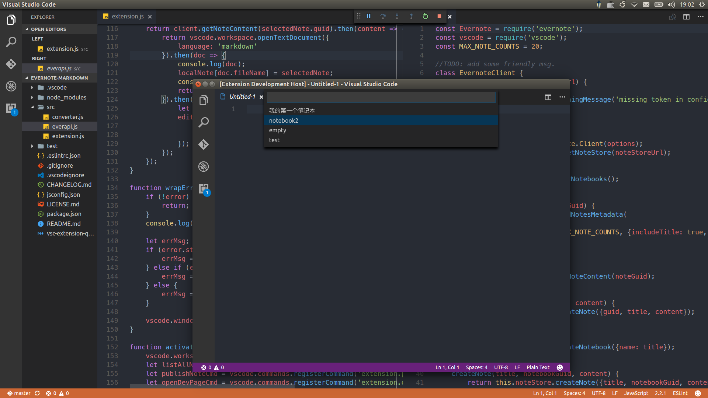
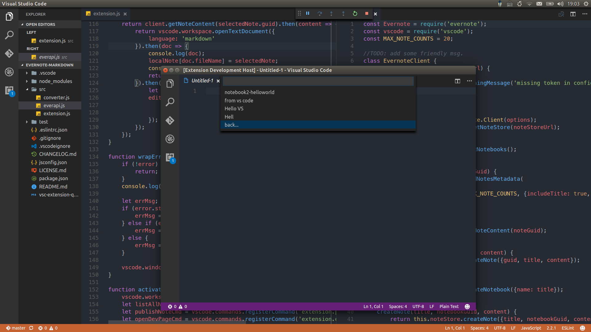
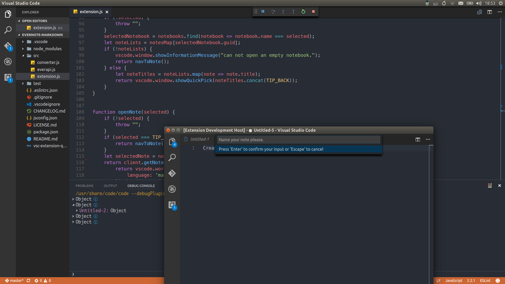

# EverMonkey

Evernoting in vscode.

## Features

You can new an untitle file, edit it and use `ever publish` to publish it to evernote.

Commands:
* `ever open` 
* `ever publish`
* `ever sync`
* `ever token`

## Extension Settings

**IMPORTANT: Please read this carefully before you start using the extension**

Use command `ever token` to help you get your token & noteStoreUrl. After enter that command (Or your can visit the page directly - [China](https://app.yinxiang.com/api/DeveloperToken.action) | [Other Countries](https://www.evernote.com/api/DeveloperToken.action)).

Then open your user setting by `Preferences: Open User Settings`, and copy&paste token info to (Search `evermonkey` to get you there):

* `evermonkey.token`: your developer token
* `evermonkey.noteStoreUrl`: your API url

**If you get an Unexpected error, then you may have to check the configuration and restart the vscode.**

## Known Issues

- Open note in notebook may cause a mess, because unsupported transfer from enml to markdown.
- You can report issues here [issues](https://github.com/michalyao/evermonkey/issues)

TODOs:
+ Add tags for note
+ More markdown style support. 

-----------------------------------------------------------------------------------------------------------

**Have fun!**

