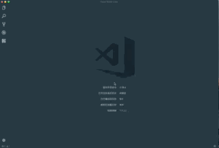

# EverMonkey

[](https://travis-ci.org/michalyao/evermonkey)
[](https://www.bithound.io/github/michalyao/evermonkey)
[](https://www.bithound.io/github/michalyao/evermonkey)
[](https://www.bithound.io/github/michalyao/evermonkey/master/dependencies/npm)
[](https://www.bithound.io/github/michalyao/evermonkey/master/dependencies/npm)


Evernoting in vscode with *Markdown* Support!

### 中国的朋友可以加我的微信公众号，**自在极客(微信号:javadev_)**。我会分享一些编程以及工作生活经验。有evermonkey 的使用问题也可以通过公众号反馈。


[Get Full Doc And Star Me](http://monkey.yoryor.top)

## Features

You can use `ever new` to create an untitle file with metadata support, edit it and use `ever publish` to publish it to evernote. And of course more than that.

Why EverMonkey is better? EverMonkey is inspired by the Sublime Text one, make local cache to avoid making net request everytime and in result
you got a faster experience.


**For tags use: you may have to use comma "," to split tags**. You can get tips if you insert tags already exsist. Otherwise a new tag will be created.

```
---
title: note title
tags: tag1, tag2, tag3
notebook: notebook
---
```


## Example




## Extension Settings

**IMPORTANT: Please read this carefully before you start using the extension**

Use command `ever token` to help you get your token & noteStoreUrl. After enter that command (Or your can visit the page directly - [China](https://app.yinxiang.com/api/DeveloperToken.action) | [Other Countries](https://www.evernote.com/api/DeveloperToken.action)).

Then open your user setting by `Preferences: Open User Settings`, and copy&paste token info to (Search `evermonkey` to get you there):

* `evermonkey.token`: your developer token
* `evermonkey.noteStoreUrl`: your API url


-----------------------------------------------------------------------------------------------------------

## Buy me a coffee

If you really like evermonkey, what about buying me a coffee? :smile:

[paypal](https://paypal.me/Michalyao)


**Have fun!**

