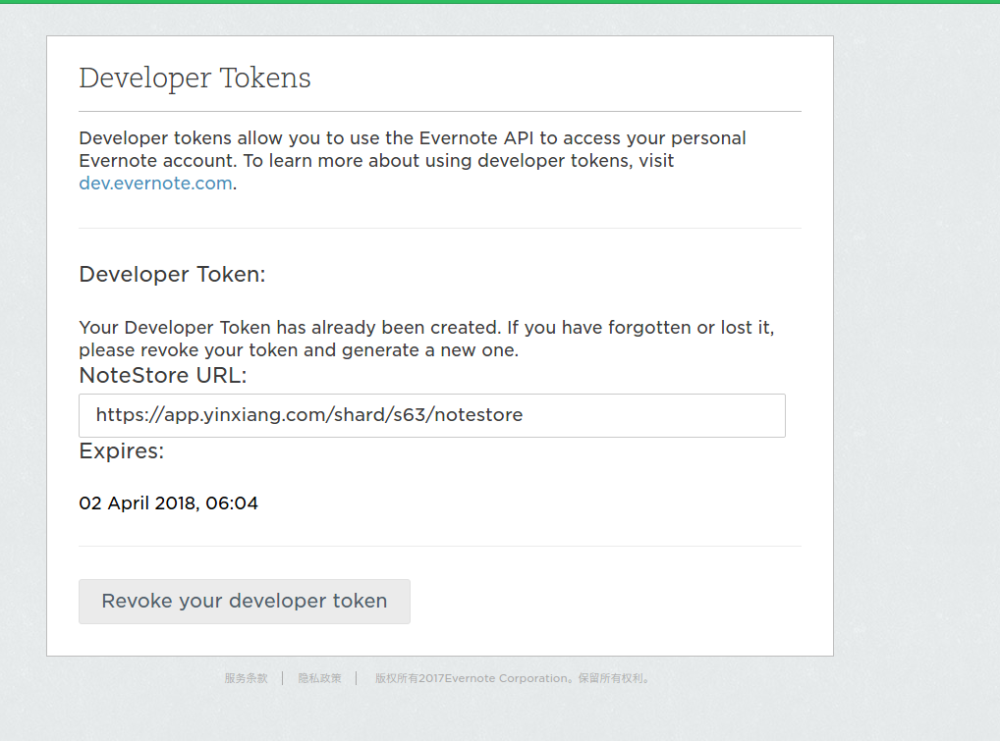
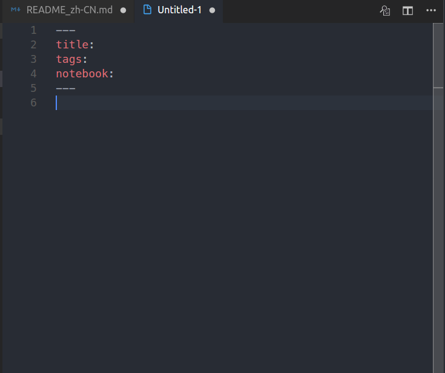

# 印象猿

印象猿(EverMonkey)是一款 VSCode 插件。使用小猿可以让你在 VSCode 中使用 Markdown 编辑，创建，更新印象笔记。

## 安装

打开 VSCode，在扩展商店中搜索 evermonkey 即可实现安装。

## 配置

在第一次使用小猿之前，需要配置印象笔记的开发者令牌。
可以使用 `ever token` 命令或者点击此处获取相关的配置信息[Evernote](https://app.yinxiang.com/api/DeveloperToken.action)

在如下页面获取 token 以及 noteStoreUrl
, 打开全局设置, 搜索evermonkey, 将对应的配置项 `evermonkey.token`, `evermonkey.noteStoreUrl` 填好即可。

## 使用

### 新建笔记 -- `ever new`

打开命令面板(F1 或者 ctrl + shift +p), 输入 `ever new` 即可新建一个空白笔记, 文档顶部是笔记元数据，包括笔记的标题，标签，所属笔记本等(不支持分级)。
当输入笔记本和标签时，如果是已经存在的，则会有代码补全提示，否则将会在印象笔记中新建。标签需要用**半角**逗号分隔。

### 打开笔记 -- `ever open`

打开命令面板, 输入 `ever open` 即可以树形结构打开印象笔记。打开后，默认会将笔记的内容转换为 markdown 格式，如果有不支持的媒体格式，那么转换后可能会影响笔记的内容。因此建议使用小猿完成纯文本编辑操作。

### 搜索笔记 -- `ever search`

打开命令面板, 输入 `ever search` 会弹出输入框, 根据输入的搜索条件返回笔记。返回的形式是 `notebook>>note`, 搜索使用的是印象笔记官方的搜索语言，比如 `tag:java` 等。更多使用方法可以查看官方文档 [Evernote Search Grammar](https://dev.evernote.com/doc/articles/search_grammar.php)

### 发布笔记 -- `ever publish`

当编辑或者更新笔记后，可以使用 `ever publish` 命令将笔记发布到印象笔记服务器上，实现笔记的同步。小猿会根据缓存信息判断是需要新建还是更新笔记，因此这部分在使用上你不必多考虑是该更新还是新建笔记，只要记住当你想同步当前笔记内容到印象笔记服务器上时，就可以使用 `ever publish` 了。

### 同步笔记 -- `ever sync`

同步笔记账户，包括笔记本，笔记，标签等。小猿在被激活后会执行一次这个命令，并且将以上内容缓存到内存中。由于印象笔记有限流，不允许过多的调用 API。因此除非你同时在多端，比如你在使用小猿的同时又在网页或者PC客户端上新建了笔记，那么就需要使用此命令来进行同步。如果一直都在VSCode内操作，那么**不需要**执行此命令。

## 建议与改进

小猿是一个开源项目，欢迎广大印象笔记和VSCode的爱好者的反馈以及PR。
在此处反馈您的建议以及使用问题。[Github issues](https://github.com/michalyao/evermonkey/issues)

如果觉得小猿还可以，就到 Github 和 VSCode 扩展商店给个星吧。
