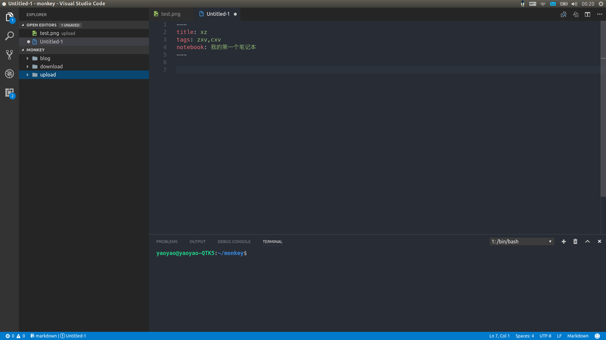

# EverMoneky

Evernote Editing. Redefined.

## Features

Edit your evernote with markdown support, with full power of VS Code.

## Principle

Monkey focuses on the currently editing untitle file. Make cache to avoid making request each time. Once you finish or abort editing you should use `ever publish` to save it on the server. Use `ever recent` to open and continue your work. If you really want to save it on the disk (this operation means revoming it from cache so you can not publish it), you can then copy & paste to a new untitle file (I mean open or create.) and publish it. Here is some best practice for using Monkey.

Here is my working directory. 

You can attach your image or other files into the upload folder. Make your download folder here too.

## Configuration

### Extension Settings

Open VS Code Command Platte(F1), input `Preferences: Open User Settings`.

The full Configuration properties list here:

- evermonkey.token: Evernote API token.
- evermonkey.noteStoreUrl: Evernote noteStoreUrl.
- evermonkey.highlightTheme: Code highlight Theme. The full languages and themes support see [highlight.js](https://highlightjs.org/static/demo/)
- evermonkey.recentNotesCount: The count of the notes returned when you enter `ever recent`.
- evermonkey.attachmentsFolder: Local directory to save server attachments.
- evermonkey.uploadFolder: Local directory to upload attachments.
- evermonkey.showTips: Whether to show you some friendly tips.
- evermonkey.fontFamily: Font family render for evernote. (What you will see in Evernote, not in vscode.)
- evermonkey.fontSize: Font size render for evernote. (What you will see in Evernote, not in vscode.)
- evermonkey.markdownTheme: Customize your own CSS theme. More details see CSS customize.(Beta)
- evermonkey.codeFontFamily: Customize your code higtlight font family.
- evermonkey.codeFontSize: Customize your code highlight font size.

### VS Code Settings

- To enable completion for tags and notebook, you may have to open the markdown quick suggestion manually, as show below:

``` json
"[markdown]": {
        "editor.quickSuggestions": true
}
```

- For Windows user, you may have to force VS Code use LF as line seperator. See [issue2957](https://github.com/Microsoft/vscode/issues/2957).

``` json
"files.eol": "\n"
```

## Commands

### `ever new`

Create a new empty file with markdown language support and metadata init.

### `ever open`

Open a note much like a tree structure.

### `ever search`

Use evernote query to search note. More details about [Evernote Search Grammar](https://dev.evernote.com/doc/articles/search_grammar.php)

### `ever publish`

Update editing note or create a new one. (Use this whenever you want to publish your note to Evernote.)

### `ever recent`

Open recently edited notes.

### `ever everclient`

View note in Evernote Client. (Note: If you edit note in client as well, the note converted to the markdown will render `<div>` or other html.)

### `ever browse`

View editing note in Evernote Web. Be sure the server has it, I mean you have already published. (Note: If you edit note in Web as well, the note converted to the markdown will render `<div>` or other html.)

### `ever attach`

Insert a attachment to currently editing file. If you have configured uploadFolder and put your file into the folder, you can specify by the file name. Otherwise, the full path for the file is needed. **Note, this operation only attach the file to local cache, you may have to use `ever publish` to update to the server.**

### `ever unattach`

Once you want to delete a local attachment, you can use this command, only cache removed.

### `ever resources`

List attachments of the currently editing note. You may see some magic here, attachments are marked as (local) or (server). The server one will be downloaded to the attachmentsFolder and opened by the default app, the local one will be opened directly.

### `ever sync`

Synchronize your Evernote account. (**Maybe you use evernote concurrently in multi endpoints, most of time I wish you dont do this**)

### `ever token`

Help you get your token & noteStoreUrl and configure.

## Shortcut

The default keybindings for monkey is alt plus the command verb's first word. For example, `alt+n` is for `ever new`. And of course, you can customize it as you like.

## Customize CSS

You can get the markdown theme file in the folder where the extension is located.

- Windows %USERPROFILE%\.vscode\extensions\michalyao.evermonkey\themes
- Mac ~/.vscode/extensions\michalyao.evermonkey/themes
- Linux ~/.vscode/extensions/michalyao.evermonkey/themes

### Edit directly

If you are familiar with CSS, you can edit the theme file `github.css` directly to change the html render in Evernote. After change the file, you have to save it and restart the vscode to enable it.

### DIY

If you have put a theme into the folder, for example `mytheme.css`, you have to configure the settings `evermonkey.markdownTheme: "mytheme.css"`. Restart the vscode, and try whether it works well. **The class must specfic as markdown-body.**

### Share

If you want to share your theme with others, feel free to make a pull request. You may have to make a clear introduction about the theme. The demo included is better and more likely to be accepted.

## Markdown Syntax

### TOC

```
[TOC]

# Do not support navigation in Evernote. Only table of contents.
## H2
### H3
```

### Headers

```
# H1
## H2
### H3
#### H4
##### H5
###### H6
```

### Emphasis

```
*This text will be italic*
_This will also be italic_

**This text will be bold**
__This will also be bold__

~~This text will be crossed~~

_You **can** combine ~~them~~_
```

### Sup and Sub

```
19^th^
H~2~O
```

### Emoji

```
:smile: :heart: :sunny: :watermelon: :cn:
```

### Link

```
http://github.com - automatic!
[GitHub](http://github.com)
```

### Blockquotes

```
As Kanye West said:

> We're living the future so
> the present is our past.
```

### List

#### unordered

```
- Item 1
- Item 2
  - Item 2a
  - Item 2b
```

#### ordered

```
1. Item 1
1. Item 2
1. Item 3
   - Item 3a
   - Item 3b
```

### Todo

```
- [x] Write blog post with :heart:
- [x] Create sample **gist**
- [ ] Take screenshots for blog post
```

### Table

```
First Header | Second Header
------------ | -------------
Content from cell 1 | Content from cell 2
Content in the first column | Content in the second column
```

### Images

```


```

### Inline code

```
This is an inline code: `var example = true`
```

### Code Highlight

``` js
console.log("Hello Monkey!");
```


### Raw HTML

```
<div style="color: red;">This is a <strong>html</strong> code.</div>
```

## License
MIT

Built by [docute](http://docute.js.org)
